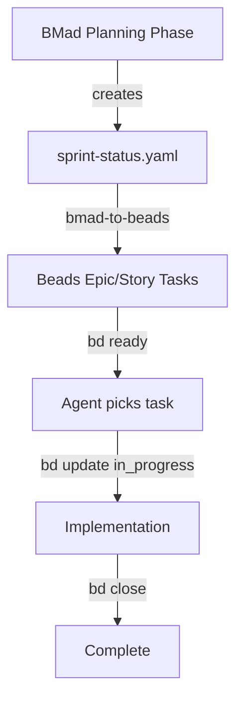

# Agent Instructions

This project uses **bd (Beads)** for AI-native issue tracking and **BMad Method** for agile AI-driven development.

---

## 📊 Task Tracking with Beads

Beads provides persistent, structured memory that lives in your repo as git-tracked JSONL files. Perfect for multi-session work and agent coordination.

### Quick Reference

```bash
bd ready              # Show tasks with no open blockers (ready to work)
bd list               # Show all open issues
bd show <id>          # View issue details and audit trail
bd create "Task" -p 0 # Create P0 (critical) task
bd update <id> --status in_progress  # Claim work
bd close <id>         # Complete work
bd dep add <child> <parent>  # Link tasks (blocks/parent-child)
bd sync               # Sync with git remote
```

### Priority Levels
| Priority | Flag | Usage |
|----------|------|-------|
| P0 | `-p 0` | Critical, blocks release |
| P1 | `-p 1` | High priority, current sprint |
| P2 | `-p 2` | Medium priority, backlog |
| P3 | `-p 3` | Low priority, nice to have |

### Task Hierarchy Pattern
```bash
# Create epic
bd create "Epic: User Authentication" -p 1 -t epic

# Create sub-tasks (auto-generates hierarchical IDs)
bd create "Design auth schema" -p 1
bd create "Implement JWT endpoints" -p 1
bd create "Add unit tests" -p 2

# Link as dependencies
bd dep add <jwt-task-id> <schema-task-id>  # JWT blocks on schema
bd dep add <test-task-id> <jwt-task-id>    # Tests block on JWT
```

### MANDATORY Workflow

**STARTING WORK:**
```bash
# 1. Find available tasks
bd ready

# 2. Claim a task
bd update <id> --status in_progress

# 3. Work...
```

**COMPLETING WORK:**
```bash
# 1. Run quality gates (if code changed)
npm test && npm run lint && npm run build

# 2. Close completed tasks
bd close <id>

# 3. Sync with git
bd sync
git add .
git commit -m "feat: description"
git pull --rebase
git push

# 4. Verify
git status  # MUST show "up to date with origin"
```

**CRITICAL RULES:**
- Work is NOT complete until `git push` succeeds
- NEVER stop before pushing - stranded work is lost work
- ALWAYS create Beads tasks for follow-up work
- Run `bd ready` before starting new work

---

## 🚀 BMad Method Integration

This project uses [BMad Method](https://github.com/bmad-code-org/BMAD-METHOD) for structured AI-driven development.

### BMad + Beads Workflow

The key principle: **BMad workflows → Beads tasks via helper script → Execution**



### 🔄 BMad to Beads Converter

**Auto-convert BMad sprint status to Beads tasks:**

```bash
# Preview what would be created
./scripts/bmad-to-beads

# Show backlog items ready to start
./scripts/bmad-to-beads --status backlog

# Show specific epic
./scripts/bmad-to-beads --epic epic-3

# Actually create Beads tasks
./scripts/bmad-to-beads --create

# Create only backlog stories for epic-1
./scripts/bmad-to-beads --create --epic epic-1 --status backlog
```

**Status Mapping:**
| BMad Status | Beads Status |
|-------------|--------------|
| backlog | todo |
| ready-for-dev | todo |
| in-progress | in_progress |
| review | in_progress |
| done | done |

**See:** `scripts/README_BMAD_TO_BEADS.md` for full documentation
```

### Quick Path (Bug Fixes, Small Features)
```bash
# 1. BMad generates tech spec with stories
/quick-spec

# 2. Create Beads tasks for each story
bd create "Story: Implement login fix" -p 1

# 3. Work the task
/dev-story

# 4. Validate
/code-review
```

### Full Planning Path (Products, Complex Features)
```bash
# Phase 1: Planning (creates Beads epics)
/product-brief        # → Beads epic for product definition
/create-prd           # → Beads epic for requirements
/create-architecture  # → Beads epic for technical design

# Phase 2: Breakdown (creates Beads stories)
/create-epics-and-stories  # → Hierarchical Beads tasks
/sprint-planning           # → Prioritized Beads tasks for sprint

# Phase 3: Execution (work from Beads)
bd ready              # Find next available story
/dev-story            # Implement the story
/code-review          # Validate quality
bd close <id>         # Mark complete
```

### Integration Pattern

| BMad Phase | Beads Action | Command |
|------------|--------------|---------|
| Product Brief | Create epic task | `bd create "Epic: [feature]" -t epic -p 1` |
| PRD Created | Add requirement tasks | `bd create "Story: [requirement]" -p 1` |
| Architecture | Add technical tasks | `bd create "Task: [component]" -p 1` |
| Story Breakdown | Create implementation tasks | `bd create "Impl: [story]" -p 0/1` |
| Sprint Planning | Prioritize & link | `bd dep add <child> <parent>` |
| Development | Work from `bd ready` | Pick tasks with no blockers |
| Code Review | Validate task completion | Review code, then `bd close` |

### Example Session

```bash
# 1. Start new feature work
/bmad-help "I need to add user notifications"

# 2. BMad guides you through planning
# This creates Beads tasks automatically

# 3. Check what's ready to work on
bd ready
# Output:
#   bd-a3f8.1 - Implement notification service API [P1]
#   bd-a3f8.2 - Design notification preferences schema [P1]

# 4. Pick up a task
bd update bd-a3f8.1 --status in_progress

# 5. Implement using BMad dev story workflow
/dev-story bd-a3f8.1

# 6. Review and complete
/code-review
bd close bd-a3f8.1

# 7. Sync everything
bd sync && git push
```

---

## 📁 Project Structure

```
shop/
├── .beads/              # Beads task database (git-tracked)
├── _bmad/               # BMad method workflows & memory
│   ├── bmm/             # BMad Method module workflows
│   ├── core/            # Core framework
│   └── _memory/         # BMad session memory
├── .agent/workflows/    # BMad workflow commands
└── AGENTS.md            # This file
```

---

## 🆘 Getting Help

| Question | Command |
|----------|---------|
| What should I do next? | `/bmad-help` |
| What tasks are ready? | `bd ready` |
| How do I use BMad? | `/bmad-help tutorial` |
| Show all tasks | `bd list` |
| BMad workflow reference | `/bmad-help workflows` |

---

## Sources

- [Beads GitHub Repository](https://github.com/steveyegge/beads)
- [BMad Method Documentation](https://github.com/bmad-code-org/BMAD-METHOD)
