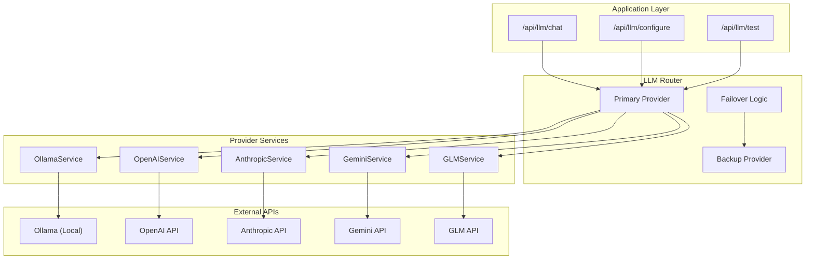

# LLM Abstraction Patterns - Epic 1

## Overview

This document documents the LLM abstraction architecture implemented in Epic 1, enabling support for multiple LLM providers (Ollama, OpenAI, Anthropic, Gemini, GLM-4.7) with consistent interfaces, automatic failover, and cost tracking capabilities.

## Table of Contents

1. [Architecture Overview](#architecture-overview)
2. [Base Service Pattern](#base-service-pattern)
3. [Provider Implementations](#provider-implementations)
4. [Router and Failover](#router-and-failover)
5. [Cost Tracking](#cost-tracking)
6. [Testing Strategy](#testing-strategy)
7. [Best Practices](#best-practices)

---

## Architecture Overview

### System Diagram



### Design Principles

1. **Interface Consistency:** All providers implement the same abstract base
2. **Provider Independence:** Switch providers without code changes
3. **Graceful Degradation:** Failover to backup on errors
4. **Cost Transparency:** Track token usage and estimated costs
5. **Test Safety:** Prevent API credit burn during testing

---

## Base Service Pattern

### Abstract Base Class

```python
# backend/app/services/llm/base_llm_service.py
from abc import ABC, abstractmethod
from dataclasses import dataclass
from typing import Optional
from datetime import datetime

@dataclass
class LLMResponse:
    """Standard LLM response format."""

    content: str
    model: str
    input_tokens: int
    output_tokens: int
    cost_usd: float
    provider: str
    timestamp: datetime

class BaseLLMService(ABC):
    """Abstract base class for LLM providers.

    All provider implementations must inherit from this class
    and implement all abstract methods. This ensures consistent
    interface across all providers.
    """

    def __init__(
        self,
        api_key: Optional[str] = None,
        model: Optional[str] = None,
        base_url: Optional[str] = None
    ):
        """Initialize LLM service.

        Args:
            api_key: API key for cloud providers (not needed for Ollama)
            model: Default model to use
            base_url: Custom base URL (useful for proxies)
        """
        self.api_key = api_key
        self.model = model
        self.base_url = base_url
        self._async_client = None

    # ----------------------------------------------------------------------
    # Required Properties
    # ----------------------------------------------------------------------

    @property
    @abstractmethod
    def provider_name(self) -> str:
        """Return provider name (e.g., 'ollama', 'openai')."""
        pass

    @property
    @abstractmethod
    def default_model(self) -> str:
        """Return default model for this provider."""
        pass

    @property
    @abstractmethod
    def available_models(self) -> list[str]:
        """Return list of available models."""
        pass

    # ----------------------------------------------------------------------
    # Required Methods
    # ----------------------------------------------------------------------

    @abstractmethod
    async def test_connection(self) -> bool:
        """Test LLM connectivity.

        Returns:
            True if connection successful, False otherwise
        """
        pass

    @abstractmethod
    async def chat(
        self,
        messages: list[dict],
        model: Optional[str] = None,
        temperature: float = 0.7,
        max_tokens: int = 1000
    ) -> LLMResponse:
        """Send chat completion request.

        Args:
            messages: List of message dicts with 'role' and 'content'
            model: Model to use (overrides default)
            temperature: Sampling temperature (0.0 to 1.0)
            max_tokens: Maximum tokens to generate

        Returns:
            LLMResponse with content, tokens, and cost

        Raises:
            APIError: If request fails
        """
        pass

    @abstractmethod
    def count_tokens(self, text: str) -> int:
        """Count tokens in text.

        Different providers use different tokenizers, so each
        implementation must provide its own token counter.

        Args:
            text: Text to count tokens in

        Returns:
            Number of tokens
        """
        pass

    @abstractmethod
    def estimate_cost(
        self,
        input_tokens: int,
        output_tokens: int,
        model: Optional[str] = None
    ) -> float:
        """Estimate cost in USD.

        Args:
            input_tokens: Number of input tokens
            output_tokens: Number of output tokens
            model: Model to use for pricing

        Returns:
            Estimated cost in USD
        """
        pass

    # ----------------------------------------------------------------------
    # Optional Utility Methods
    # ----------------------------------------------------------------------

    def format_messages(self, messages: list[dict]) -> list[dict]:
        """Format messages for API.

        Default implementation passes through. Override if provider
        requires specific message format.

        Args:
            messages: List of message dicts

        Returns:
            Formatted messages
        """
        return messages

    def validate_temperature(self, temperature: float) -> float:
        """Validate and clamp temperature value.

        Args:
            temperature: Temperature to validate

        Returns:
            Clamped temperature between 0.0 and 1.0
        """
        return max(0.0, min(1.0, temperature))
```

---

## Provider Implementations

### Ollama Service (Local)

```python
# backend/app/services/llm/ollama_service.py
import httpx
from typing import Optional
from app.services.llm.base_llm_service import BaseLLMService, LLMResponse
from app.core.config import settings

class OllamaService(BaseLLMService):
    """Ollama LLM service for local inference.

    Ollama provides free local LLM inference with models like
    Llama 3, Mistral, and Gemma. No API key required.

    Pricing: Free (local compute only)
    """

    # Model pricing (for comparison)
    COST_PER_1M_INPUT = 0.0
    COST_PER_1M_OUTPUT = 0.0

    def __init__(
        self,
        base_url: str = "http://localhost:11434",
        model: str = "llama3"
    ):
        super().__init__(base_url=base_url, model=model)
        self.ollama_url = base_url
        self.is_testing = settings.is_testing

    @property
    def provider_name(self) -> str:
        return "ollama"

    @property
    def default_model(self) -> str:
        return self.model or "llama3"

    @property
    def available_models(self) -> list[str]:
        return ["llama3", "llama3:70b", "mistral", "gemma", "phi3"]

    @property
    def async_client(self) -> httpx.AsyncClient:
        """Get or create async HTTP client.

        During testing, use ASGITransport to prevent actual HTTP calls.
        """
        if self._async_client is None:
            if self.is_testing:
                from httpx import ASGITransport
                self._async_client = httpx.AsyncClient(
                    transport=ASGITransport(),
                    base_url="http://test"
                )
            else:
                self._async_client = httpx.AsyncClient(
                    base_url=self.ollama_url
                )
        return self._async_client

    async def test_connection(self) -> bool:
        """Test Ollama connectivity."""
        try:
            response = await self.async_client.get("/api/tags")
            return response.status_code == 200
        except Exception:
            return False

    async def chat(
        self,
        messages: list[dict],
        model: Optional[str] = None,
        temperature: float = 0.7,
        max_tokens: int = 1000
    ) -> LLMResponse:
        """Send chat completion request to Ollama."""
        model = model or self.default_model
        temperature = self.validate_temperature(temperature)

        payload = {
            "model": model,
            "messages": self.format_messages(messages),
            "stream": False,
            "options": {
                "temperature": temperature,
                "num_predict": max_tokens
            }
        }

        response = await self.async_client.post(
            "/api/chat",
            json=payload,
            timeout=httpx.Timeout(60.0)
        )
        response.raise_for_status()

        data = response.json()
        content = data.get("message", {}).get("content", "")

        # Estimate tokens (rough approximation: ~4 chars per token)
        input_text = "\n".join(m.get("content", "") for m in messages)
        input_tokens = len(input_text) // 4
        output_tokens = len(content) // 4

        return LLMResponse(
            content=content,
            model=model,
            input_tokens=input_tokens,
            output_tokens=output_tokens,
            cost_usd=self.estimate_cost(input_tokens, output_tokens, model),
            provider=self.provider_name,
            timestamp=datetime.utcnow()
        )

    def count_tokens(self, text: str) -> int:
        """Approximate token count (Ollama doesn't expose tokenizer)."""
        return len(text) // 4

    def estimate_cost(
        self,
        input_tokens: int,
        output_tokens: int,
        model: Optional[str] = None
    ) -> float:
        """Ollama is free (local compute only)."""
        return 0.0
```

### OpenAI Service

```python
# backend/app/services/llm/openai_service.py
import httpx
from typing import Optional
from app.services.llm.base_llm_service import BaseLLMService, LLMResponse

class OpenAIService(BaseLLMService):
    """OpenAI GPT service.

    Models: gpt-4o-mini, gpt-4o, gpt-3.5-turbo

    Pricing (gpt-4o-mini):
    - Input: $0.15 per 1M tokens
    - Output: $0.60 per 1M tokens
    """

    # Pricing per 1M tokens
    PRICING = {
        "gpt-4o-mini": {"input": 0.15, "output": 0.60},
        "gpt-4o": {"input": 2.50, "output": 10.00},
        "gpt-3.5-turbo": {"input": 0.50, "output": 1.50}
    }

    BASE_URL = "https://api.openai.com/v1"

    def __init__(self, api_key: str, model: str = "gpt-4o-mini"):
        super().__init__(api_key=api_key, model=model)
        if not api_key:
            raise ValueError("OpenAI API key required")

    @property
    def provider_name(self) -> str:
        return "openai"

    @property
    def default_model(self) -> str:
        return self.model or "gpt-4o-mini"

    @property
    def available_models(self) -> list[str]:
        return ["gpt-4o-mini", "gpt-4o", "gpt-3.5-turbo"]

    @property
    def async_client(self) -> httpx.AsyncClient:
        if self._async_client is None:
            headers = {
                "Authorization": f"Bearer {self.api_key}",
                "Content-Type": "application/json"
            }
            self._async_client = httpx.AsyncClient(
                base_url=self.BASE_URL,
                headers=headers
            )
        return self._async_client

    async def test_connection(self) -> bool:
        """Test OpenAI API connectivity."""
        try:
            response = await self.async_client.get("/models")
            return response.status_code == 200
        except Exception:
            return False

    async def chat(
        self,
        messages: list[dict],
        model: Optional[str] = None,
        temperature: float = 0.7,
        max_tokens: int = 1000
    ) -> LLMResponse:
        """Send chat completion request to OpenAI."""
        model = model or self.default_model
        temperature = self.validate_temperature(temperature)

        payload = {
            "model": model,
            "messages": self.format_messages(messages),
            "temperature": temperature,
            "max_tokens": max_tokens
        }

        response = await self.async_client.post(
            "/chat/completions",
            json=payload,
            timeout=httpx.Timeout(30.0)
        )
        response.raise_for_status()

        data = response.json()
        choice = data["choices"][0]
        usage = data["usage"]

        return LLMResponse(
            content=choice["message"]["content"],
            model=model,
            input_tokens=usage["prompt_tokens"],
            output_tokens=usage["completion_tokens"],
            cost_usd=self.estimate_cost(
                usage["prompt_tokens"],
                usage["completion_tokens"],
                model
            ),
            provider=self.provider_name,
            timestamp=datetime.utcnow()
        )

    def count_tokens(self, text: str) -> int:
        """Approximate token count (OpenAI uses ~4 chars per token)."""
        return len(text) // 4

    def estimate_cost(
        self,
        input_tokens: int,
        output_tokens: int,
        model: Optional[str] = None
    ) -> float:
        """Calculate cost in USD."""
        model = model or self.default_model
        pricing = self.PRICING.get(model, self.PRICING["gpt-4o-mini"])

        input_cost = (input_tokens / 1_000_000) * pricing["input"]
        output_cost = (output_tokens / 1_000_000) * pricing["output"]

        return input_cost + output_cost
```

### Anthropic Service

```python
# backend/app/services/llm/anthropic_service.py
import httpx
from typing import Optional
from app.services.llm.base_llm_service import BaseLLMService, LLMResponse

class AnthropicService(BaseLLMService):
    """Anthropic Claude service.

    Models: claude-3-haiku, claude-3-sonnet, claude-3-opus

    Pricing (claude-3-haiku):
    - Input: $0.25 per 1M tokens
    - Output: $1.25 per 1M tokens
    """

    # Pricing per 1M tokens
    PRICING = {
        "claude-3-haiku": {"input": 0.25, "output": 1.25},
        "claude-3-sonnet": {"input": 3.00, "output": 15.00},
        "claude-3-opus": {"input": 15.00, "output": 75.00}
    }

    BASE_URL = "https://api.anthropic.com/v1"

    def __init__(self, api_key: str, model: str = "claude-3-haiku"):
        super().__init__(api_key=api_key, model=model)
        if not api_key:
            raise ValueError("Anthropic API key required")

    @property
    def provider_name(self) -> str:
        return "anthropic"

    @property
    def default_model(self) -> str:
        return self.model or "claude-3-haiku"

    @property
    def available_models(self) -> list[str]:
        return ["claude-3-haiku", "claude-3-sonnet", "claude-3-opus"]

    @property
    def async_client(self) -> httpx.AsyncClient:
        if self._async_client is None:
            headers = {
                "x-api-key": self.api_key,
                "anthropic-version": "2023-06-01",
                "Content-Type": "application/json"
            }
            self._async_client = httpx.AsyncClient(
                base_url=self.BASE_URL,
                headers=headers
            )
        return self._async_client

    async def test_connection(self) -> bool:
        """Test Anthropic API connectivity."""
        try:
            response = await self.async_client.post(
                "/messages",
                json={
                    "model": self.default_model,
                    "max_tokens": 1,
                    "messages": [{"role": "user", "content": "Hi"}]
                },
                timeout=httpx.Timeout(10.0)
            )
            return response.status_code == 200
        except Exception:
            return False

    async def chat(
        self,
        messages: list[dict],
        model: Optional[str] = None,
        temperature: float = 0.7,
        max_tokens: int = 1000
    ) -> LLMResponse:
        """Send message request to Anthropic."""
        model = model or self.default_model
        temperature = self.validate_temperature(temperature)

        # Anthropic requires system message to be separate
        system_message = None
        user_messages = []

        for msg in messages:
            if msg["role"] == "system":
                system_message = msg["content"]
            else:
                user_messages.append(msg)

        payload = {
            "model": model,
            "messages": user_messages,
            "max_tokens": max_tokens,
            "temperature": temperature
        }

        if system_message:
            payload["system"] = system_message

        response = await self.async_client.post(
            "/messages",
            json=payload,
            timeout=httpx.Timeout(30.0)
        )
        response.raise_for_status()

        data = response.json()

        return LLMResponse(
            content=data["content"][0]["text"],
            model=model,
            input_tokens=data["usage"]["input_tokens"],
            output_tokens=data["usage"]["output_tokens"],
            cost_usd=self.estimate_cost(
                data["usage"]["input_tokens"],
                data["usage"]["output_tokens"],
                model
            ),
            provider=self.provider_name,
            timestamp=datetime.utcnow()
        )

    def count_tokens(self, text: str) -> int:
        """Approximate token count."""
        return len(text) // 4

    def estimate_cost(
        self,
        input_tokens: int,
        output_tokens: int,
        model: Optional[str] = None
    ) -> float:
        """Calculate cost in USD."""
        model = model or self.default_model
        pricing = self.PRICING.get(model, self.PRICING["claude-3-haiku"])

        input_cost = (input_tokens / 1_000_000) * pricing["input"]
        output_cost = (output_tokens / 1_000_000) * pricing["output"]

        return input_cost + output_cost
```

---

## Router and Failover

### LLM Router Implementation

```python
# backend/app/services/llm/llm_router.py
from typing import Optional
from app.services.llm.base_llm_service import BaseLLMService, LLMResponse
from app.services.llm.ollama_service import OllamaService
from app.services.llm.openai_service import OpenAIService
from app.services.llm.anthropic_service import AnthropicService
from app.core.errors import APIError, ErrorCode
import logging

logger = logging.getLogger(__name__)

class LLMRouter:
    """Router with automatic failover to backup provider.

    The router manages a primary and backup LLM provider. If the
    primary fails, it automatically falls back to the backup.

    This provides high availability and cost optimization:
    - Use Ollama (free) as primary
    - Use OpenAI/Anthropic (paid) as backup
    """

    PROVIDER_MAP = {
        "ollama": OllamaService,
        "openai": OpenAIService,
        "anthropic": AnthropicService,
        # Add more providers as needed
    }

    def __init__(
        self,
        primary_provider: BaseLLMService,
        backup_provider: Optional[BaseLLMService] = None
    ):
        """Initialize LLM router.

        Args:
            primary_provider: Primary LLM service to use
            backup_provider: Fallback service if primary fails
        """
        self.primary_provider = primary_provider
        self.backup_provider = backup_provider
        self._use_backup = False

    @classmethod
    def from_config(cls, config: dict) -> "LLMRouter":
        """Create router from configuration.

        Args:
            config: Dict with 'primary' and 'backup' provider configs

        Example:
            config = {
                "primary": {
                    "provider": "ollama",
                    "model": "llama3"
                },
                "backup": {
                    "provider": "openai",
                    "api_key": "sk-...",
                    "model": "gpt-4o-mini"
                }
            }
        """
        primary_config = config.get("primary", {})
        backup_config = config.get("backup")

        # Create primary provider
        primary_cls = cls.PROVIDER_MAP.get(primary_config["provider"])
        if not primary_cls:
            raise ValueError(f"Unknown provider: {primary_config['provider']}")

        primary_provider = primary_cls(**primary_config)

        # Create backup provider (optional)
        backup_provider = None
        if backup_config:
            backup_cls = cls.PROVIDER_MAP.get(backup_config["provider"])
            if backup_cls:
                backup_provider = backup_cls(**backup_config)

        return cls(primary_provider, backup_provider)

    async def chat(
        self,
        messages: list[dict],
        use_backup: bool = False,
        **kwargs
    ) -> LLMResponse:
        """Send chat using primary with automatic failover.

        Args:
            messages: List of message dicts
            use_backup: Force use of backup provider
            **kwargs: Additional arguments (model, temperature, etc.)

        Returns:
            LLMResponse

        Raises:
            APIError: If both primary and backup fail
        """
        provider = self.backup_provider if use_backup else self.primary_provider

        if not provider:
            raise APIError(
                ErrorCode.LLM_SERVICE_UNAVAILABLE,
                "No LLM provider configured"
            )

        try:
            response = await provider.chat(messages, **kwargs)

            # Log successful request
            logger.info(
                "llm_request_success",
                provider=provider.provider_name,
                model=response.model,
                input_tokens=response.input_tokens,
                output_tokens=response.output_tokens,
                cost_usd=response.cost_usd
            )

            return response

        except Exception as e:
            # If primary fails and backup exists, try backup
            if self.backup_provider and not use_backup:
                logger.warning(
                    "llm_primary_failed",
                    error=str(e),
                    fallback_to="backup"
                )

                try:
                    return await self.chat(messages, use_backup=True, **kwargs)
                except Exception as backup_error:
                    raise APIError(
                        ErrorCode.LLM_SERVICE_UNAVAILABLE,
                        f"Both providers failed. Primary: {str(e)}, Backup: {str(backup_error)}"
                    )

            # No backup or backup failed
            logger.error("llm_request_failed", error=str(e))
            raise

    async def test_connection(self) -> dict:
        """Test connectivity for all configured providers.

        Returns:
            Dict with connection status for each provider
        """
        results = {
            "primary": {
                "provider": self.primary_provider.provider_name,
                "connected": await self.primary_provider.test_connection()
            }
        }

        if self.backup_provider:
            results["backup"] = {
                "provider": self.backup_provider.provider_name,
                "connected": await self.backup_provider.test_connection()
            }

        return results

    @property
    def current_provider(self) -> str:
        """Return the provider name that would be used."""
        return self.primary_provider.provider_name
```

### Usage Example

```python
# backend/app/api/llm.py
from fastapi import APIRouter, Depends
from app.services.llm.llm_router import LLMRouter
from app.core.dependencies import get_llm_router

router = APIRouter(prefix="/api/llm", tags=["LLM"])

@router.post("/chat")
async def chat(
    request: ChatRequest,
    llm_router: LLMRouter = Depends(get_llm_router)
):
    """Send chat message with automatic failover.

    If primary provider (Ollama) fails, automatically falls back
    to backup provider (OpenAI/Anthropic).
    """
    messages = [
        {"role": "system", "content": "You are a helpful assistant."},
        {"role": "user", "content": request.message}
    ]

    response = await llm_router.chat(
        messages,
        temperature=request.temperature,
        max_tokens=request.max_tokens
    )

    return {
        "content": response.content,
        "model": response.model,
        "tokens": {
            "input": response.input_tokens,
            "output": response.output_tokens
        },
        "cost_usd": response.cost_usd,
        "provider": response.provider
    }
```

---

## Cost Tracking

### Database Schema

```python
# backend/app/models/llm_configuration.py
from sqlalchemy import Column, Integer, String, Float, DateTime, JSONB, Enum
from datetime import datetime

class LLMConversationCost(Base):
    """Track LLM conversation costs for billing and analytics."""

    __tablename__ = "llm_conversation_costs"

    id = Column(Integer, primary_key=True)
    merchant_id = Column(Integer, nullable=False, index=True)

    # Request metadata
    provider = Column(String, nullable=False)
    model = Column(String, nullable=False)

    # Token usage
    input_tokens = Column(Integer, nullable=False)
    output_tokens = Column(Integer, nullable=False)
    total_tokens = Column(Integer, nullable=False)

    # Cost tracking
    estimated_cost_usd = Column(Float, nullable=False)

    # For analytics
    conversation_context = Column(JSONB, nullable=True)

    created_at = Column(DateTime, default=datetime.utcnow, nullable=False)
```

### Cost Tracking Middleware

```python
# backend/app/services/llm/cost_tracker.py
from sqlalchemy.ext.asyncio import AsyncSession
from app.models.llm_configuration import LLMConversationCost
from app.services.llm.base_llm_service import LLMResponse

async def track_conversation_cost(
    session: AsyncSession,
    merchant_id: int,
    response: LLMResponse,
    context: dict = None
):
    """Track LLM conversation cost in database.

    Args:
        session: Database session
        merchant_id: Merchant ID for cost attribution
        response: LLM response with token and cost data
        context: Optional conversation context (e.g., conversation_id)
    """
    cost_record = LLMConversationCost(
        merchant_id=merchant_id,
        provider=response.provider,
        model=response.model,
        input_tokens=response.input_tokens,
        output_tokens=response.output_tokens,
        total_tokens=response.input_tokens + response.output_tokens,
        estimated_cost_usd=response.cost_usd,
        conversation_context=context or {}
    )

    session.add(cost_record)
    await session.commit()

# Integrate with router
class LLMRouter:
    async def chat_with_tracking(
        self,
        session: AsyncSession,
        merchant_id: int,
        messages: list[dict],
        context: dict = None,
        **kwargs
    ) -> LLMResponse:
        """Send chat and track cost."""
        response = await self.chat(messages, **kwargs)

        # Track cost asynchronously
        await track_conversation_cost(
            session,
            merchant_id,
            response,
            context
        )

        return response
```

---

## Testing Strategy

### IS_TESTING Pattern

```python
# backend/app/core/config.py
from pydantic_settings import BaseSettings

class Settings(BaseSettings):
    """Application settings with testing flag."""

    # CRITICAL: Set to "true" in test environment
    is_testing: bool = False

    class Config:
        env_file = ".env"

settings = Settings()

# backend/app/services/llm/ollama_service.py
from app.core.config import settings

class OllamaService(BaseLLMService):
    @property
    def async_client(self) -> httpx.AsyncClient:
        """Get or create async HTTP client.

        During testing, use ASGITransport to prevent actual HTTP calls.
        This prevents API credit burn during automated tests.
        """
        if self._async_client is None:
            if settings.is_testing:
                from httpx import ASGITransport
                self._async_client = httpx.AsyncClient(
                    transport=ASGITransport(),
                    base_url="http://test"
                )
            else:
                self._async_client = httpx.AsyncClient(
                    base_url=self.ollama_url
                )
        return self._async_client
```

### Test Configuration

```python
# backend/tests/conftest.py
import pytest
import os
from httpx import ASGITransport
from app.main import app

@pytest.fixture(scope="session", autouse=True)
def set_testing_mode():
    """Set IS_TESTING flag for all tests."""
    os.environ["IS_TESTING"] = "true"
    os.environ["DEBUG"] = "true"
    yield
    os.environ["IS_TESTING"] = "false"

@pytest.fixture
async def llm_router():
    """Create test LLM router with mocked providers."""
    from app.services.llm.llm_router import LLMRouter

    config = {
        "primary": {
            "provider": "ollama",
            "model": "llama3"
        }
    }

    return LLMRouter.from_config(config)

@pytest.fixture
async def mock_llm_response():
    """Mock LLM response for testing."""
    from app.services.llm.base_llm_service import LLMResponse
    from datetime import datetime

    return LLMResponse(
        content="Test response",
        model="llama3",
        input_tokens=10,
        output_tokens=5,
        cost_usd=0.0,
        provider="ollama",
        timestamp=datetime.utcnow()
    )
```

### Test Examples

```python
# backend/tests/services/test_llm_router.py
import pytest
from app.core.errors import APIError

class TestLLMRouter:
    """Test LLM router functionality."""

    @pytest.mark.asyncio
    async def test_chat_with_primary(self, llm_router):
        """Test successful chat with primary provider."""
        messages = [{"role": "user", "content": "Hello"}]

        response = await llm_router.chat(messages)

        assert response.content is not None
        assert response.provider == "ollama"

    @pytest.mark.asyncio
    async def test_failover_to_backup(self):
        """Test automatic failover to backup provider."""
        from app.services.llm.llm_router import LLMRouter
        from app.services.llm.ollama_service import OllamaService
        from unittest.mock import AsyncMock, patch

        # Create failing primary
        primary = OllamaService(model="llama3")

        # Create working backup
        backup = OllamaService(model="mistral")

        router = LLMRouter(primary, backup)

        # Mock primary to fail
        with patch.object(primary, "chat", side_effect=Exception("Primary failed")):
            # Mock backup to succeed
            backup_response = AsyncMock(
                content="Backup response",
                provider="ollama"
            )
            with patch.object(backup, "chat", return_value=backup_response):
                response = await router.chat([{"role": "user", "content": "Hi"}])

                assert response.provider == "ollama"

    @pytest.mark.asyncio
    async def test_both_providers_fail(self):
        """Test error when both providers fail."""
        from app.services.llm.llm_router import LLMRouter
        from app.services.llm.ollama_service import OllamaService
        from unittest.mock import patch

        primary = OllamaService(model="llama3")
        backup = OllamaService(model="mistral")

        router = LLMRouter(primary, backup)

        # Mock both to fail
        with patch.object(primary, "chat", side_effect=Exception("Primary failed")):
            with patch.object(backup, "chat", side_effect=Exception("Backup failed")):
                with pytest.raises(APIError) as exc_info:
                    await router.chat([{"role": "user", "content": "Hi"}])

                assert "LLM_SERVICE_UNAVAILABLE" in str(exc_info.value)
```

---

## Best Practices

### For Developers

1. **Always use the router** instead of direct provider access
2. **Configure backup provider** for high availability
3. **Track costs** for all production conversations
4. **Use IS_TESTING flag** to prevent API credit burn
5. **Sanitize inputs** before sending to LLM (see security patterns)

### For Architects

1. **Design for provider independence** - abstract all provider specifics
2. **Implement graceful degradation** - fallback to backup on errors
3. **Monitor token usage** - set up alerts for cost anomalies
4. **Cache responses** - reduce redundant API calls
5. **Implement rate limiting** - prevent runaway costs

### For DevOps

1. **Secure API keys** - use environment variables, never commit
2. **Monitor LLM endpoints** - track latency and error rates
3. **Set up alerts** - for cost anomalies and failures
4. **Document configuration** - keep provider settings up to date
5. **Test failover** - regularly verify backup connectivity

---

## Provider Comparison

| Provider | Model | Input Cost | Output Cost | Latency | Use Case |
|----------|-------|------------|-------------|---------|----------|
| Ollama | llama3 | $0.00 | $0.00 | ~4s | Free local, privacy-first |
| OpenAI | gpt-4o-mini | $0.15/1M | $0.60/1M | ~2.5s | Fast, cost-effective |
| Anthropic | claude-3-haiku | $0.25/1M | $1.25/1M | ~3s | Fast, accurate |
| Gemini | gemini-1.5-flash | $0.075/1M | $0.30/1M | ~2s | Google ecosystem |
| GLM-4.7 | glm-4-flash | ¥0.10/1M | ¥0.10/1M | ~3s | China market |

---

*Document Version: 1.0*
*Last Updated: 2026-02-04*
*Maintainer: Team Mantis B*
