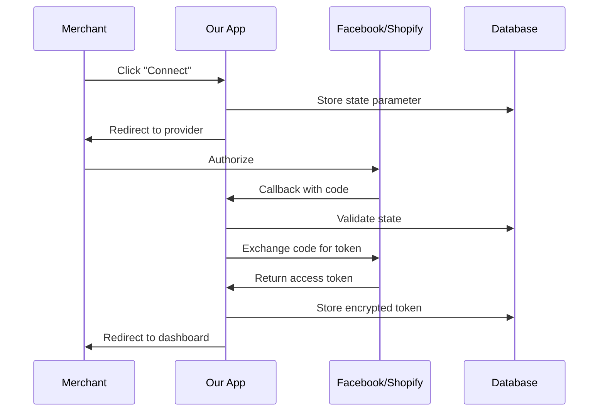

# OAuth Integration Patterns - Epic 1

## Overview

This document captures the OAuth 2.0 integration patterns implemented for Facebook and Shopify in Epic 1. These patterns include state management for CSRF protection, token encryption, secure callback handling, and comprehensive testing.

## Table of Contents

1. [OAuth Flow Overview](#oauth-flow-overview)
2. [State Management (CSRF Protection)](#state-management-csrf-protection)
3. [Facebook OAuth Implementation](#facebook-oauth-implementation)
4. [Shopify OAuth Implementation](#shopify-oauth-implementation)
5. [Token Encryption](#token-encryption)
6. [Error Handling](#error-handling)
7. [Testing OAuth Flows](#testing-oauth-flows)

---

## OAuth Flow Overview

### Standard OAuth 2.0 Authorization Code Flow



### Security Requirements

| Requirement | Implementation | Purpose |
|-------------|----------------|---------|
| CSRF Protection | State parameter validation | Prevent authorization hijacking |
| Token Storage | Fernet encryption | Protect tokens at rest |
| Token Transmission | HTTPS only | Protect tokens in transit |
| Scope Validation | Verify granted scopes | Ensure minimum permissions |
| Error Messages | No sensitive data leakage | Prevent information disclosure |

---

## State Management (CSRF Protection)

### Challenge

OAuth flows are vulnerable to CSRF attacks where an attacker can:

1. Initiate OAuth flow on victim's behalf
2. Trick victim into completing authorization
3. Hijack the authorization for attacker's account

### Solution: Cryptographic State Parameter with Redis

```python
# backend/app/core/security.py
import secrets
import redis
import json
from datetime import datetime
from typing import Dict, Any

def generate_oauth_state() -> str:
    """Generate cryptographically secure random state string.

    Uses secrets.token_urlsafe() which returns a URL-safe text string
    containing random bytes. 32 bytes = 256 bits of entropy.

    Returns:
        URL-safe random string
    """
    return secrets.token_urlsafe(32)

async def store_oauth_state(merchant_id: int, state: str) -> None:
    """Store OAuth state in Redis with TTL.

    The state parameter prevents CSRF attacks by ensuring the OAuth callback
    originates from the same session that initiated the request.

    Args:
        merchant_id: The merchant ID initiating OAuth
        state: Cryptographically secure random state string
    """
    redis_client = redis.from_url(os.getenv("REDIS_URL"))
    state_data = {
        "merchant_id": merchant_id,
        "state": state,
        "timestamp": datetime.utcnow().isoformat()
    }
    redis_client.setex(
        f"oauth_state:{state}",
        600,  # 10 minute TTL
        json.dumps(state_data)
    )

async def validate_oauth_state(state: str, merchant_id: int) -> bool:
    """Validate OAuth state and consume (one-time use).

    This function implements three security properties:
    1. Expiration: States older than TTL are rejected
    2. One-time use: Valid states are deleted after validation
    3. Binding: State is bound to the merchant_id

    Args:
        state: The state parameter from OAuth callback
        merchant_id: The merchant ID from session

    Returns:
        True if state is valid and consumed, False otherwise
    """
    redis_client = redis.from_url(os.getenv("REDIS_URL"))
    state_data = redis_client.get(f"oauth_state:{state}")

    if not state_data:
        return False

    data = json.loads(state_data)
    valid = data.get("merchant_id") == merchant_id

    if valid:
        redis_client.delete(f"oauth_state:{state}")  # One-time use

    return valid
```

### Security Properties

1. **Cryptographic Randomness:** 256 bits of entropy prevents brute force
2. **Time-Bound:** 10-minute TTL limits window for attacks
3. **One-Time Use:** States are consumed after validation
4. **User Binding:** State tied to merchant_id prevents cross-user attacks

---

## Facebook OAuth Implementation

### OAuth Configuration

```python
# backend/app/core/config.py
from pydantic_settings import BaseSettings

class FacebookSettings(BaseSettings):
    """Facebook OAuth configuration."""

    app_id: str
    app_secret: str
    redirect_uri: str
    scopes: list[str] = [
        "pages_messaging",    # Send/receive messages
        "pages_show_list"     # List managed pages
    ]

    class Config:
        env_prefix = "FACEBOOK_"

facebook_settings = FacebookSettings()
```

### Authorization Endpoint

```python
# backend/app/api/integrations/facebook.py
from fastapi import APIRouter, Depends, HTTPException, Query
from app.core.security import generate_oauth_state, store_oauth_state
from app.core.config import facebook_settings
from app.core.errors import APIError, ErrorCode

router = APIRouter(prefix="/api/integrations/facebook", tags=["Facebook"])

@router.get("/authorize")
async def authorize_facebook(
    merchant_id: int = Query(..., description="Merchant ID"),
    redirect_uri: str = Query(None, description="Override redirect URI")
):
    """Initiate Facebook OAuth flow.

    Step 1 of OAuth flow:
    1. Generate state parameter for CSRF protection
    2. Store state in Redis with merchant_id binding
    3. Return authorization URL

    Args:
        merchant_id: The merchant ID initiating OAuth
        redirect_uri: Optional override for redirect URI

    Returns:
        Authorization URL for user to visit
    """
    # Generate state for CSRF protection
    state = generate_oauth_state()
    await store_oauth_state(merchant_id, state)

    # Build authorization URL
    auth_url = (
        f"https://www.facebook.com/v18.0/dialog/oauth?"
        f"client_id={facebook_settings.app_id}&"
        f"redirect_uri={redirect_uri or facebook_settings.redirect_uri}&"
        f"scope={','.join(facebook_settings.scopes)}&"
        f"response_type=code&"
        f"state={state}"
    )

    return {
        "authorization_url": auth_url,
        "state": state  # Return for debugging (remove in production)
    }
```

### Callback Endpoint

```python
# backend/app/api/integrations/facebook.py
from app.core.security import validate_oauth_state, encrypt_access_token
from app.services.facebook import FacebookService

@router.get("/callback")
async def facebook_callback(
    code: str = Query(..., description="Authorization code"),
    state: str = Query(..., description="State parameter"),
    merchant_id: int = Query(..., description="Merchant ID from session")
):
    """Handle Facebook OAuth callback.

    Step 2 of OAuth flow:
    1. Validate state parameter (CSRF protection)
    2. Exchange code for access token
    3. Encrypt and store access token

    Args:
        code: Authorization code from Facebook
        state: State parameter from authorization
        merchant_id: Merchant ID from session

    Returns:
        Success response with connection status

    Raises:
        APIError: If state validation fails or token exchange fails
    """
    # Step 1: Validate state (CSRF protection)
    if not await validate_oauth_state(state, merchant_id):
        raise APIError(
            ErrorCode.FACEBOOK_OAUTH_STATE_MISMATCH,
            "OAuth state validation failed. Please try again."
        )

    # Step 2: Exchange code for access token
    try:
        facebook_service = FacebookService()
        token_response = await facebook_service.exchange_code_for_token(code)
    except Exception as e:
        raise APIError(
            ErrorCode.FACEBOOK_OAUTH_TOKEN_EXCHANGE_FAILED,
            f"Failed to exchange authorization code: {str(e)}"
        )

    # Step 3: Validate scopes
    required_scopes = {"pages_messaging", "pages_show_list"}
    granted_scopes = set(token_response.get("scopes", []))

    if not required_scopes.issubset(granted_scopes):
        raise APIError(
            ErrorCode.FACEBOOK_OAUTH_INSUFFICIENT_SCOPES,
            f"Required scopes not granted: {required_scopes - granted_scopes}"
        )

    # Step 4: Encrypt and store token
    access_token = token_response["access_token"]
    encrypted_token = encrypt_access_token(access_token)

    # Store in database
    integration = FacebookIntegration(
        merchant_id=merchant_id,
        access_token=encrypted_token,
        page_id=token_response.get("page_id"),
        scopes=json.dumps(list(granted_scopes))
    )
    session.add(integration)
    await session.commit()

    return {
        "status": "connected",
        "message": "Facebook account connected successfully"
    }
```

### Token Exchange Implementation

```python
# backend/app/services/facebook.py
import httpx
from app.core.config import facebook_settings

class FacebookService:
    """Facebook Graph API service."""

    TOKEN_URL = "https://graph.facebook.com/v18.0/oauth/access_token"

    async def exchange_code_for_token(self, code: str) -> dict:
        """Exchange authorization code for access token.

        Args:
            code: Authorization code from callback

        Returns:
            Dict with access_token, token_type, expires_in

        Raises:
            httpx.HTTPError: If request fails
        """
        async with httpx.AsyncClient() as client:
            response = await client.get(
                self.TOKEN_URL,
                params={
                    "client_id": facebook_settings.app_id,
                    "client_secret": facebook_settings.app_secret,
                    "redirect_uri": facebook_settings.redirect_uri,
                    "code": code
                }
            )
            response.raise_for_status()
            return response.json()

    async def get_managed_pages(self, access_token: str) -> list[dict]:
        """Get list of managed pages for the user.

        Args:
            access_token: User access token

        Returns:
            List of page objects with id, name, access_token
        """
        async with httpx.AsyncClient() as client:
            response = await client.get(
                "https://graph.facebook.com/v18.0/me/accounts",
                headers={"Authorization": f"Bearer {access_token}"}
            )
            response.raise_for_status()
            data = response.json()
            return data.get("data", [])
```

---

## Shopify OAuth Implementation

### OAuth Configuration

```python
# backend/app/core/config.py
class ShopifySettings(BaseSettings):
    """Shopify OAuth configuration."""

    api_key: str
    api_secret: str
    redirect_uri: str
    scopes: list[str] = [
        "read_products",      # Read product data
        "read_orders",        # Read order data
        "write_webhooks"      # Create webhooks
    ]

    class Config:
        env_prefix = "SHOPIFY_"

shopify_settings = ShopifySettings()
```

### Authorization Endpoint (Shopify-Specific)

```python
# backend/app/api/integrations/shopify.py
from fastapi import APIRouter, Depends, Query
from app.core.security import generate_oauth_state, store_oauth_state
from app.core.config import shopify_settings

router = APIRouter(prefix="/api/integrations/shopify", tags=["Shopify"])

@router.get("/authorize")
async def authorize_shopify(
    merchant_id: int = Query(...),
    shop: str = Query(..., description="Shopify shop domain")
):
    """Initiate Shopify OAuth flow.

    Shopify OAuth requires the shop domain parameter.

    Args:
        merchant_id: The merchant ID
        shop: Shopify shop domain (e.g., "mystore.myshopify.com")

    Returns:
        Authorization URL for user to visit
    """
    # Validate shop domain format
    if not shop.endswith(".myshopify.com"):
        raise HTTPException(
            status_code=400,
            detail="Invalid shop domain. Must end with .myshopify.com"
        )

    # Generate state
    state = generate_oauth_state()
    await store_oauth_state(merchant_id, state)

    # Shopify requires "nonce" parameter (similar to state)
    nonce = secrets.token_urlsafe(32)

    # Build authorization URL
    auth_url = (
        f"https://{shop}/admin/oauth/authorize?"
        f"client_id={shopify_settings.api_key}&"
        f"scope={','.join(shopify_settings.scopes)}&"
        f"redirect_uri={shopify_settings.redirect_uri}&"
        f"state={state}&"
        f"nonce={nonce}"
    )

    return {
        "authorization_url": auth_url,
        "shop": shop,
        "state": state
    }
```

### Callback Endpoint

```python
# backend/app/api/integrations/shopify.py
from app.core.security import validate_oauth_state, encrypt_access_token
from app.services.shopify import ShopifyService

@router.get("/callback")
async def shopify_callback(
    code: str = Query(...),
    state: str = Query(...),
    shop: str = Query(...),
    merchant_id: int = Query(...)
):
    """Handle Shopify OAuth callback.

    Args:
        code: Authorization code
        state: State parameter
        shop: Shopify shop domain
        merchant_id: Merchant ID from session

    Returns:
        Success response
    """
    # Validate state
    if not await validate_oauth_state(state, merchant_id):
        raise APIError(
            ErrorCode.SHOPIFY_OAUTH_STATE_MISMATCH,
            "OAuth state validation failed"
        )

    # Exchange code for access token
    try:
        shopify_service = ShopifyService(shop)
        token_response = await shopify_service.exchange_code_for_token(code)
    except Exception as e:
        raise APIError(
            ErrorCode.SHOPIFY_OAUTH_TOKEN_EXCHANGE_FAILED,
            f"Failed to exchange code: {str(e)}"
        )

    # Store encrypted token
    encrypted_token = encrypt_access_token(token_response["access_token"])

    integration = ShopifyIntegration(
        merchant_id=merchant_id,
        shop_domain=shop,
        access_token=encrypted_token
    )
    session.add(integration)
    await session.commit()

    return {
        "status": "connected",
        "shop": shop,
        "message": "Shopify store connected successfully"
    }
```

### Token Exchange Implementation

```python
# backend/app/services/shopify.py
import httpx
import hmac
import hashlib
import base64

class ShopifyService:
    """Shopify Admin API service."""

    def __init__(self, shop_domain: str):
        self.shop_domain = shop_domain
        self.admin_api_url = f"https://{shop_domain}/admin/api/2024-01"

    async def exchange_code_for_token(self, code: str) -> dict:
        """Exchange authorization code for access token.

        Args:
            code: Authorization code from callback

        Returns:
            Dict with access_token, scope
        """
        async with httpx.AsyncClient() as client:
            response = await client.post(
                f"{self.admin_api_url}/access_token.json",
                json={
                    "client_id": shopify_settings.api_key,
                    "client_secret": shopify_settings.api_secret,
                    "code": code
                }
            )
            response.raise_for_status()
            return response.json()["access_token"]
```

---

## Token Encryption

### Fernet Encryption for OAuth Tokens

```python
# backend/app/core/security.py
from cryptography.fernet import Fernet
import os

def get_fernet() -> Fernet:
    """Get Fernet instance for token encryption."""
    key = os.getenv("ENCRYPTION_KEY")
    if not key:
        raise ValueError("ENCRYPTION_KEY not set in environment")
    return Fernet(key.encode())

def encrypt_access_token(token: str) -> str:
    """Encrypt access token using Fernet.

    Args:
        token: Plain text access token

    Returns:
        Base64-encoded encrypted token
    """
    fernet = get_fernet()
    encrypted = fernet.encrypt(token.encode())
    return encrypted.decode()

def decrypt_access_token(encrypted: str) -> str:
    """Decrypt encrypted access token.

    Args:
        encrypted: Base64-encoded encrypted token

    Returns:
        Plain text access token
    """
    fernet = get_fernet()
    decrypted = fernet.decrypt(encrypted.encode())
    return decrypted.decode()
```

### Database Model with Encrypted Tokens

```python
# backend/app/models/integrations.py
from sqlalchemy import Column, Integer, String, JSONB
from app.core.security import encrypt_access_token, decrypt_access_token

class FacebookIntegration(Base):
    """Facebook OAuth integration with encrypted tokens."""

    __tablename__ = "facebook_integrations"

    id = Column(Integer, primary_key=True)
    merchant_id = Column(Integer, nullable=False)
    _access_token = Column("access_token", String, nullable=False)
    page_id = Column(String)
    scopes = Column(JSONB)

    @property
    def access_token(self) -> str:
        """Decrypt and return access token."""
        return decrypt_access_token(self._access_token)

    @access_token.setter
    def access_token(self, token: str):
        """Encrypt and set access token."""
        self._access_token = encrypt_access_token(token)

class ShopifyIntegration(Base):
    """Shopify OAuth integration with encrypted tokens."""

    __tablename__ = "shopify_integrations"

    id = Column(Integer, primary_key=True)
    merchant_id = Column(Integer, nullable=False)
    shop_domain = Column(String, nullable=False)
    _access_token = Column("access_token", String, nullable=False)

    @property
    def access_token(self) -> str:
        """Decrypt and return access token."""
        return decrypt_access_token(self._access_token)

    @access_token.setter
    def access_token(self, token: str):
        """Encrypt and set access token."""
        self._access_token = encrypt_access_token(token)
```

---

## Error Handling

### Standardized OAuth Error Responses

```python
# backend/app/core/errors.py
class ErrorCode(str, Enum):
    """OAuth-related error codes."""

    FACEBOOK_OAUTH_DENIED = "facebook_oauth_001"
    FACEBOOK_OAUTH_STATE_MISMATCH = "facebook_oauth_002"
    FACEBOOK_OAUTH_TOKEN_EXCHANGE_FAILED = "facebook_oauth_003"
    FACEBOOK_OAUTH_INSUFFICIENT_SCOPES = "facebook_oauth_004"

    SHOPIFY_OAUTH_DENIED = "shopify_oauth_001"
    SHOPIFY_OAUTH_STATE_MISMATCH = "shopify_oauth_002"
    SHOPIFY_OAUTH_TOKEN_EXCHANGE_FAILED = "shopify_oauth_003"
```

### Error Handler

```python
# backend/app/api/integrations/facebook.py
from fastapi import Request
from fastapi.responses import JSONResponse

@router.get("/callback")
async def facebook_callback(...):
    try:
        # OAuth flow
        ...
    except APIError as e:
        return JSONResponse(
            status_code=400,
            content={
                "code": e.code,
                "message": "Failed to connect Facebook account",
                "details": {
                    "error": e.user_message,
                    "action": "Please try again or contact support"
                }
            }
        )
    except Exception as e:
        logger.error("oauth_callback_error", error=str(e))
        return JSONResponse(
            status_code=500,
            content={
                "code": "internal_error",
                "message": "An unexpected error occurred",
                "details": None
            }
        )
```

---

## Testing OAuth Flows

### Test State Validation

```python
# backend/tests/core/test_oauth.py
import pytest
from app.core.security import (
    generate_oauth_state,
    store_oauth_state,
    validate_oauth_state
)

class TestOAuthState:
    """Test OAuth state management."""

    @pytest.mark.asyncio
    async def test_state_validation_flow(self):
        """Test complete state storage and validation."""
        merchant_id = 1
        state = generate_oauth_state()

        # Store state
        await store_oauth_state(merchant_id, state)

        # Validate should succeed
        valid = await validate_oauth_state(state, merchant_id)
        assert valid is True

    @pytest.mark.asyncio
    async def test_state_one_time_use(self):
        """Test that states can only be used once."""
        state = generate_oauth_state()

        await store_oauth_state(merchant_id=1, state=state)

        # First use succeeds
        valid1 = await validate_oauth_state(state, merchant_id=1)
        assert valid1 is True

        # Second use fails
        valid2 = await validate_oauth_state(state, merchant_id=1)
        assert valid2 is False

    @pytest.mark.asyncio
    async def test_state_merchant_binding(self):
        """Test that states are bound to merchant ID."""
        state = generate_oauth_state()

        await store_oauth_state(merchant_id=1, state=state)

        # Different merchant ID fails
        valid = await validate_oauth_state(state, merchant_id=2)
        assert valid is False
```

---

*Document Version: 1.0*
*Last Updated: 2026-02-04*
*Maintainer: Team Mantis B*
