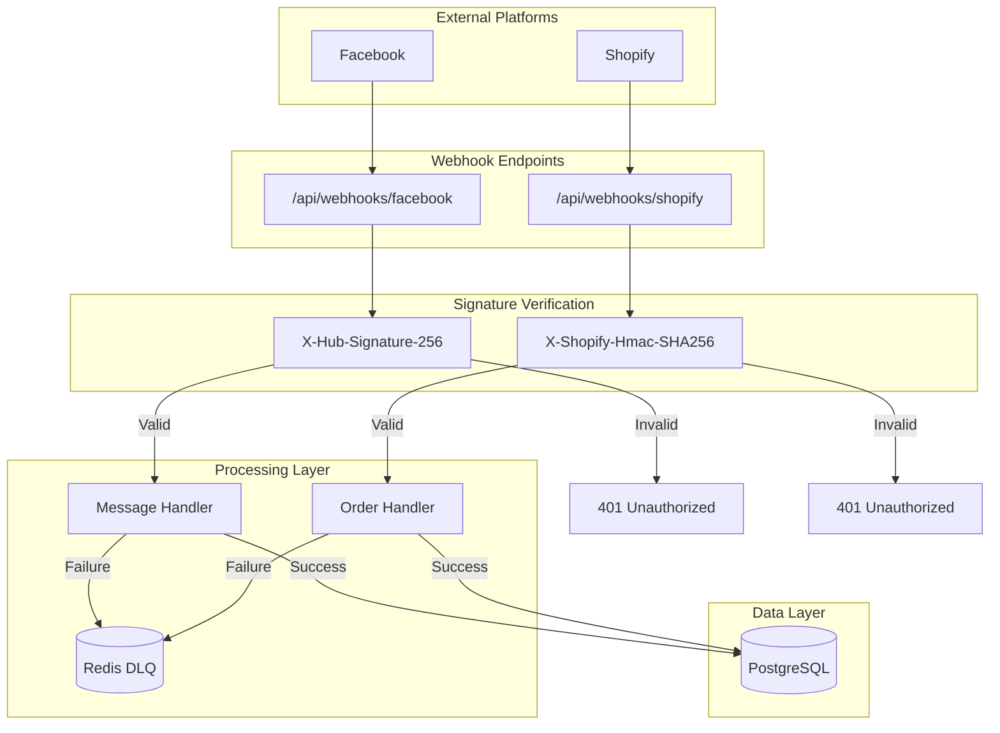

# Webhook Processing Patterns - Epic 1

## Overview

This document captures the webhook processing patterns implemented for Facebook and Shopify in Epic 1. These patterns include signature verification, dead letter queues, retry logic, and comprehensive diagnostic tools.

## Table of Contents

1. [Webhook Architecture](#webhook-architecture)
2. [Signature Verification](#signature-verification)
3. [Facebook Webhooks](#facebook-webhooks)
4. [Shopify Webhooks](#shopify-webhooks)
5. [Dead Letter Queue](#dead-letter-queue)
6. [Webhook Verification Tool](#webhook-verification-tool)
7. [Testing Webhooks](#testing-webhooks)

---

## Webhook Architecture

### System Overview



### Security Requirements

| Requirement | Implementation | Purpose |
|-------------|----------------|---------|
| Authentication | HMAC signature verification | Verify webhook source |
| Integrity | SHA-256 hashing | Detect payload tampering |
| Replay Protection | Constant-time comparison | Prevent timing attacks |
| Reliability | Dead Letter Queue | Handle processing failures |

---

## Signature Verification

### Facebook Webhook Signature

```python
# backend/app/services/facebook.py
import hmac
import hashlib
from secrets import compare_digest

async def verify_webhook_signature(
    raw_payload: bytes,
    signature: str,
    app_secret: str
) -> bool:
    """Verify Facebook webhook signature.

    Facebook sends X-Hub-Signature-256 header containing:
    sha256=<HMAC-SHA256-of-payload>

    This prevents:
    1. Spoofed webhooks (attacker can't compute HMAC without secret)
    2. Message tampering (any change invalidates HMAC)
    3. Timing attacks (constant-time comparison)

    Args:
        raw_payload: Raw request body as bytes
        signature: X-Hub-Signature-256 header value
        app_secret: Facebook app secret

    Returns:
        True if signature is valid, False otherwise
    """
    if not signature or not signature.startswith("sha256="):
        return False

    expected_hash = signature[7:]  # Remove "sha256=" prefix
    computed_hash = hmac.new(
        app_secret.encode(),
        raw_payload,
        hashlib.sha256
    ).hexdigest()

    # Use compare_digest to prevent timing attacks
    return compare_digest(computed_hash, expected_hash)
```

### Shopify Webhook HMAC

```python
# backend/app/services/shopify.py
import hmac
import hashlib
import base64
from secrets import compare_digest

async def verify_shopify_hmac(
    raw_payload: bytes,
    hmac_header: str,
    api_secret: str
) -> bool:
    """Verify Shopify webhook HMAC.

    Shopify uses base64-encoded HMAC-SHA256.

    Args:
        raw_payload: Raw request body as bytes
        hmac_header: X-Shopify-Hmac-SHA256 header value
        api_secret: Shopify API secret

    Returns:
        True if HMAC is valid, False otherwise
    """
    if not hmac_header:
        return False

    try:
        # Decode base64 HMAC from header
        expected_hmac = base64.b64decode(hmac_header)
    except Exception:
        return False

    # Compute HMAC of payload
    computed_hmac = hmac.new(
        api_secret.encode(),
        raw_payload,
        hashlib.sha256
    ).digest()

    # Use constant-time comparison
    return compare_digest(computed_hmac, expected_hmac)
```

### FastAPI Integration

```python
# backend/app/api/webhooks/facebook.py
from fastapi import Request, HTTPException
from app.services.facebook import verify_webhook_signature

@router.post("/facebook")
async def facebook_webhook(request: Request):
    """Handle Facebook webhook with signature verification."""
    raw_payload = await request.body()

    # Extract signature from header
    signature = request.headers.get("X-Hub-Signature-256")
    if not signature:
        raise HTTPException(
            status_code=401,
            detail="Missing signature header"
        )

    # Verify signature
    if not await verify_webhook_signature(
        raw_payload,
        signature,
        os.getenv("FACEBOOK_APP_SECRET")
    ):
        raise HTTPException(
            status_code=401,
            detail="Invalid signature"
        )

    # Process verified webhook
    data = json.loads(raw_payload)
    await process_facebook_message(data)

    return {"status": "received"}
```

---

## Facebook Webhooks

### Message Processing

```python
# backend/app/services/facebook.py
class FacebookService:
    """Facebook webhook processing service."""

    async def process_webhook_message(self, webhook_data: dict) -> None:
        """Process incoming Facebook webhook message.

        Args:
            webhook_data: Parsed webhook payload

        Raises:
            APIError: If message processing fails
        """
        try:
            # Extract message data
            entries = webhook_data.get("entry", [])
            for entry in entries:
                messaging_events = entry.get("messaging", [])
                for event in messaging_events:
                    await self._process_message_event(event)

        except Exception as e:
            logger.error("facebook_webhook_processing_failed", error=str(e))
            # Enqueue to DLQ for retry
            await self.enqueue_failed_webhook(webhook_data, str(e))
            raise

    async def _process_message_event(self, event: dict) -> None:
        """Process individual messaging event.

        Args:
            event: Messaging event object
        """
        sender_id = event.get("sender", {}).get("id")
        recipient_id = event.get("recipient", {}).get("id")
        message = event.get("message", {})

        if not sender_id or not message.get("text"):
            return

        # Store message in database
        db_message = Message(
            sender_id=sender_id,
            recipient_id=recipient_id,
            content=message["text"],
            message_metadata={
                "mid": message.get("mid"),
                "seq": message.get("seq")
            }
        )

        from app.database import get_db
        async for db in get_db():
            db.add(db_message)
            await db.commit()

        # Trigger LLM response generation
        await self._generate_llm_response(sender_id, message["text"])

    async def _generate_llm_response(self, sender_id: str, message_text: str) -> None:
        """Generate LLM response to user message.

        Args:
            sender_id: Facebook sender ID
            message_text: User's message text
        """
        from app.services.llm import get_llm_router

        # Sanitize input
        from app.services.llm.sanitizer import sanitize_llm_input
        safe_message = sanitize_llm_input(message_text)

        # Get LLM response
        llm_router = get_llm_router()
        response = await llm_router.chat([
            {"role": "system", "content": "You are a helpful merchant assistant."},
            {"role": "user", "content": safe_message}
        ])

        # Send response via Facebook Send API
        await self._send_message(sender_id, response.content)

    async def _send_message(self, recipient_id: str, message_text: str) -> None:
        """Send message via Facebook Send API.

        Args:
            recipient_id: Facebook recipient ID
            message_text: Message text to send
        """
        from app.core.security import decrypt_access_token
        from app.models.integrations import FacebookIntegration

        # Get page access token
        async for db in get_db():
            integration = await db.find(
                FacebookIntegration,
                FacebookIntegration.merchant_id == 1  # TODO: Get from context
            )

        page_access_token = decrypt_access_token(integration.access_token)

        # Send message
        async with httpx.AsyncClient() as client:
            response = await client.post(
                f"https://graph.facebook.com/v18.0/{integration.page_id}/messages",
                params={"access_token": page_access_token},
                json={
                    "recipient": {"id": recipient_id},
                    "message": {"text": message_text}
                }
            )
            response.raise_for_status()
```

### Webhook Registration

```python
# backend/app/services/facebook.py
class FacebookService:
    async def subscribe_to_webhooks(self, page_id: str, access_token: str) -> None:
        """Subscribe to Facebook webhooks for a page.

        Args:
            page_id: Facebook page ID
            access_token: Page access token

        Raises:
            httpx.HTTPError: If subscription fails
        """
        webhook_url = f"{settings.base_url}/api/webhooks/facebook"
        verify_token = os.getenv("FACEBOOK_WEBHOOK_VERIFY_TOKEN")

        fields = [
            "messages",           # Receive messages
            "messaging_postbacks", # Receive postbacks
            "message_echoes"      # Receive message echoes
        ]

        async with httpx.AsyncClient() as client:
            # Subscribe to page messages
            for field in fields:
                response = await client.post(
                    f"https://graph.facebook.com/v18.0/{page_id}/subscribed_apps",
                    params={"access_token": access_token},
                    json={
                        "object": "page",
                        "callback_url": webhook_url,
                        "fields": [field],
                        "verify_token": verify_token
                    }
                )
                response.raise_for_status()
```

---

## Shopify Webhooks

### Order Processing

```python
# backend/app/services/shopify.py
class ShopifyService:
    """Shopify webhook processing service."""

    async def process_order_webhook(self, webhook_data: dict) -> None:
        """Process Shopify order webhook.

        Args:
            webhook_data: Parsed webhook payload

        Raises:
            APIError: If order processing fails
        """
        try:
            order_id = webhook_data.get("id")
            email = webhook_data.get("email")

            if not order_id:
                raise ValueError("Missing order ID in webhook")

            # Store order in database
            order = ShopifyOrder(
                order_id=str(order_id),
                email=email,
                total_price=webhook_data.get("total_price"),
                currency=webhook_data.get("currency"),
                financial_status=webhook_data.get("financial_status"),
                order_data=webhook_data
            )

            from app.database import get_db
            async for db in get_db():
                db.add(order)
                await db.commit()

            logger.info("shopify_order_processed", order_id=order_id)

        except Exception as e:
            logger.error("shopify_webhook_processing_failed", error=str(e))
            await self.enqueue_failed_webhook(webhook_data, str(e))
            raise

    async def subscribe_to_webhooks(self, shop_domain: str, access_token: str) -> None:
        """Subscribe to Shopify webhooks.

        Args:
            shop_domain: Shopify shop domain
            access_token: Shopify access token

        Raises:
            httpx.HTTPError: If subscription fails
        """
        webhook_url = f"{settings.base_url}/api/webhooks/shopify"

        topics = [
            "orders/create",        # New orders
            "orders/updated",       # Order updates
            "app/uninstalled"       # App uninstallation
        ]

        async with httpx.AsyncClient() as client:
            for topic in topics:
                response = await client.post(
                    f"https://{shop_domain}/admin/api/2024-01/webhooks.json",
                    headers={"X-Shopify-Access-Token": access_token},
                    json={
                        "webhook": {
                            "topic": topic,
                            "address": webhook_url,
                            "format": "json"
                        }
                    }
                )
                response.raise_for_status()

                logger.info("shopify_webhook_subscribed", topic=topic)
```

---

## Dead Letter Queue

### Pattern: Redis-Based DLQ

**Challenge:** Handle failed webhooks without message loss.

**Solution:** Redis-based Dead Letter Queue with exponential backoff retry.

```python
# backend/app/services/facebook.py
import redis
import json
from datetime import datetime

class FacebookService:
    """Facebook service with DLQ support."""

    DLQ_KEY = "webhook:dlq:facebook"
    MAX_ATTEMPTS = 3
    RETRY_DELAYS = [60, 300, 900]  # 1min, 5min, 15min

    async def enqueue_failed_webhook(
        self,
        webhook_data: dict,
        error: str
    ) -> None:
        """Queue failed webhook for retry.

        Args:
            webhook_data: Original webhook payload
            error: Error message describing failure
        """
        redis_client = redis.from_url(os.getenv("REDIS_URL"))

        retry_data = {
            "webhook_data": webhook_data,
            "error": error,
            "attempts": 0,
            "timestamp": datetime.utcnow().isoformat()
        }

        redis_client.rpush(self.DLQ_KEY, json.dumps(retry_data))

        logger.warning(
            "facebook_webhook_enqueued_dlq",
            error=error,
            dlq_length=redis_client.llen(self.DLQ_KEY)
        )

    async def process_dlq(self) -> None:
        """Process webhooks in DLQ with retry logic.

        This should be called by a background worker/cron job.
        """
        redis_client = redis.from_url(os.getenv("REDIS_URL"))

        while True:
            # Get next item from DLQ (blocking)
            item = redis_client.lpop(self.DLQ_KEY)
            if not item:
                break

            retry_data = json.loads(item)
            attempts = retry_data.get("attempts", 0)

            if attempts >= self.MAX_ATTEMPTS:
                # Max attempts reached, log and discard
                logger.error(
                    "facebook_webhook_failed_permanently",
                    webhook_data=retry_data["webhook_data"],
                    error=retry_data["error"]
                )
                continue

            # Increment attempt counter
            retry_data["attempts"] += 1

            try:
                # Retry processing
                await self.process_webhook_message(retry_data["webhook_data"])
                logger.info("facebook_webhook_retry_succeeded")

            except Exception as e:
                # Retry failed, re-enqueue with incremented attempts
                retry_data["error"] = str(e)
                retry_data["timestamp"] = datetime.utcnow().isoformat()

                # Calculate delay based on attempt number
                delay = self.RETRY_DELAYS[min(attempts, len(self.RETRY_DELAYS) - 1)]

                # Add to retry queue with TTL
                redis_client.rpush(
                    f"{self.DLQ_KEY}:retry:{delay}",
                    json.dumps(retry_data)
                )
```

### Background Worker

```python
# backend/app/workers/webhook_worker.py
import asyncio
from app.services.facebook import FacebookService
from app.services.shopify import ShopifyService

async def webhook_worker():
    """Background worker to process DLQ.

    Runs every 5 minutes to retry failed webhooks.
    """
    while True:
        try:
            # Process Facebook DLQ
            facebook_service = FacebookService()
            await facebook_service.process_dlq()

            # Process Shopify DLQ
            shopify_service = ShopifyService()
            await shopify_service.process_dlq()

        except Exception as e:
            logger.error("webhook_worker_error", error=str(e))

        # Wait 5 minutes before next run
        await asyncio.sleep(300)

# Run with: python -m app.workers.webhook_worker
if __name__ == "__main__":
    asyncio.run(webhook_worker())
```

---

## Webhook Verification Tool

### Unified Verification Service

```python
# backend/app/services/webhook_verification.py
from typing import Dict, Any
from app.models.integrations import FacebookIntegration, ShopifyIntegration

class WebhookVerificationService:
    """Unified webhook verification service."""

    async def get_verification_status(self, merchant_id: int) -> Dict[str, Any]:
        """Get webhook verification status for all platforms.

        Args:
            merchant_id: Merchant ID

        Returns:
            Dict with platform status
        """
        status = {
            "facebook": await self._verify_facebook(merchant_id),
            "shopify": await self._verify_shopify(merchant_id)
        }

        return status

    async def _verify_facebook(self, merchant_id: int) -> Dict[str, Any]:
        """Verify Facebook webhook connection.

        Args:
            merchant_id: Merchant ID

        Returns:
            Dict with connection status and details
        """
        from app.database import get_db

        async for db in get_db():
            integration = await db.find(
                FacebookIntegration,
                FacebookIntegration.merchant_id == merchant_id
            )

        if not integration:
            return {
                "connected": False,
                "message": "Facebook account not connected"
            }

        # Check if webhook is subscribed
        try:
            from app.core.security import decrypt_access_token
            access_token = decrypt_access_token(integration.access_token)

            async with httpx.AsyncClient() as client:
                response = await client.get(
                    f"https://graph.facebook.com/v18.0/{integration.page_id}/subscribed_apps",
                    params={"access_token": access_token}
                )
                response.raise_for_status()

                data = response.json()
                subscribed = data.get("data", [])

                return {
                    "connected": True,
                    "webhook_active": len(subscribed) > 0,
                    "page_id": integration.page_id,
                    "subscribed_fields": [s.get("field") for s in subscribed]
                }

        except Exception as e:
            return {
                "connected": True,
                "webhook_active": False,
                "error": str(e)
            }

    async def _verify_shopify(self, merchant_id: int) -> Dict[str, Any]:
        """Verify Shopify webhook connection.

        Args:
            merchant_id: Merchant ID

        Returns:
            Dict with connection status and details
        """
        from app.database import get_db

        async for db in get_db():
            integration = await db.find(
                ShopifyIntegration,
                ShopifyIntegration.merchant_id == merchant_id
            )

        if not integration:
            return {
                "connected": False,
                "message": "Shopify store not connected"
            }

        # Check webhook subscriptions
        try:
            from app.core.security import decrypt_access_token
            access_token = decrypt_access_token(integration.access_token)

            async with httpx.AsyncClient() as client:
                response = await client.get(
                    f"https://{integration.shop_domain}/admin/api/2024-01/webhooks.json",
                    headers={"X-Shopify-Access-Token": access_token}
                )
                response.raise_for_status()

                data = response.json()
                webhooks = data.get("webhooks", [])

                return {
                    "connected": True,
                    "webhook_active": len(webhooks) > 0,
                    "shop_domain": integration.shop_domain,
                    "webhook_count": len(webhooks),
                    "topics": [w.get("topic") for w in webhooks]
                }

        except Exception as e:
            return {
                "connected": True,
                "webhook_active": False,
                "error": str(e)
            }

    async def send_test_webhook(
        self,
        platform: str,
        merchant_id: int
    ) -> Dict[str, Any]:
        """Send test webhook to verify connectivity.

        Args:
            platform: 'facebook' or 'shopify'
            merchant_id: Merchant ID

        Returns:
            Dict with test result
        """
        if platform == "facebook":
            return await self._send_facebook_test(merchant_id)
        elif platform == "shopify":
            return await self._send_shopify_test(merchant_id)
        else:
            raise ValueError(f"Unknown platform: {platform}")

    async def _send_facebook_test(self, merchant_id: int) -> Dict[str, Any]:
        """Send test message via Facebook Messenger.

        This sends a test webhook by triggering a real message
        through the Facebook Send API, which should trigger
        our webhook endpoint.

        Args:
            merchant_id: Merchant ID

        Returns:
            Dict with test result
        """
        from app.database import get_db
        from app.models.integrations import FacebookIntegration
        from app.core.security import decrypt_access_token

        async for db in get_db():
            integration = await db.find(
                FacebookIntegration,
                FacebookIntegration.merchant_id == merchant_id
            )

        if not integration:
            return {"success": False, "error": "Facebook not connected"}

        access_token = decrypt_access_token(integration.access_token)

        # Send test message to page
        test_message = "Test webhook message - Epic 1 verification"

        async with httpx.AsyncClient() as client:
            response = await client.post(
                f"https://graph.facebook.com/v18.0/me/messages",
                params={"access_token": access_token},
                json={
                    "recipient": {"id": integration.page_id},
                    "message": {"text": test_message}
                }
            )

            if response.status_code == 200:
                return {
                    "success": True,
                    "message": "Test webhook sent successfully"
                }
            else:
                return {
                    "success": False,
                    "error": response.text
                }
```

### API Endpoints

```python
# backend/app/api/webhooks/verification.py
from fastapi import APIRouter, Depends, Query
from app.services.webhook_verification import WebhookVerificationService

router = APIRouter(prefix="/api/webhooks/verification", tags=["Webhook Verification"])

@router.get("/status")
async def get_verification_status(
    merchant_id: int = Query(..., description="Merchant ID")
):
    """Get webhook verification status for all platforms.

    Returns connection status, webhook subscription status,
    and any error details for each platform.
    """
    service = WebhookVerificationService()
    status = await service.get_verification_status(merchant_id)

    return {
        "merchant_id": merchant_id,
        "platforms": status
    }

@router.post("/test-facebook")
async def test_facebook_webhook(
    merchant_id: int = Query(..., description="Merchant ID")
):
    """Send test webhook for Facebook.

    This sends a test message that should trigger the webhook.
    """
    service = WebhookVerificationService()
    result = await service.send_test_webhook("facebook", merchant_id)

    return result

@router.post("/test-shopify")
async def test_shopify_webhook(
    merchant_id: int = Query(..., description="Merchant ID")
):
    """Send test webhook for Shopify.

    This triggers a test order creation webhook.
    """
    service = WebhookVerificationService()
    result = await service.send_test_webhook("shopify", merchant_id)

    return result

@router.post("/resubscribe/{platform}")
async def resubscribe_webhooks(
    platform: str,
    merchant_id: int = Query(..., description="Merchant ID")
):
    """Re-subscribe to webhooks for a platform.

    This can be used if webhooks were disconnected or
    during initial setup.
    """
    # Implementation depends on platform
    # ... re-subscription logic
```

---

## Testing Webhooks

### Signature Verification Tests

```python
# backend/tests/services/test_facebook_webhooks.py
import pytest
import hmac
import hashlib
import json

class TestFacebookWebhookVerification:
    """Test Facebook webhook signature verification."""

    def test_valid_signature_passes(self):
        """Test that valid signatures are accepted."""
        payload = b'{"object": "page"}'
        secret = "test_secret"

        signature = "sha256=" + hmac.new(
            secret.encode(),
            payload,
            hashlib.sha256
        ).hexdigest()

        valid = verify_webhook_signature(payload, signature, secret)
        assert valid is True

    def test_invalid_signature_fails(self):
        """Test that invalid signatures are rejected."""
        payload = b'{"object": "page"}'
        signature = "sha256=invalid"

        valid = verify_webhook_signature(payload, signature, "secret")
        assert valid is False

    def test_tampered_payload_detected(self):
        """Test that payload tampering is detected."""
        payload = b'{"object": "page"}'
        secret = "test_secret"

        signature = "sha256=" + hmac.new(
            secret.encode(),
            payload,
            hashlib.sha256
        ).hexdigest()

        # Tamper with payload
        tampered = b'{"object": "post"}'

        valid = verify_webhook_signature(tampered, signature, secret)
        assert valid is False

    def test_missing_signature_header_rejected(self):
        """Test that missing signature is rejected."""
        payload = b'{"object": "page"}'

        valid = verify_webhook_signature(payload, "", "secret")
        assert valid is False

        valid = verify_webhook_signature(payload, None, "secret")
        assert valid is False
```

### DLQ Tests

```python
# backend/tests/services/test_webhook_dlq.py
import pytest
import redis

class TestWebhookDeadLetterQueue:
    """Test webhook dead letter queue processing."""

    @pytest.mark.asyncio
    async def test_enqueue_failed_webhook(self):
        """Test that failed webhooks are enqueued."""
        service = FacebookService()
        webhook_data = {"object": "page", "entry": []}

        await service.enqueue_failed_webhook(webhook_data, "Test error")

        redis_client = redis.from_url(os.getenv("REDIS_URL"))
        dlq_length = redis_client.llen(service.DLQ_KEY)

        assert dlq_length == 1

    @pytest.mark.asyncio
    async def test_dlq_retry_with_backoff(self):
        """Test that DLQ retry uses exponential backoff."""
        service = FacebookService()

        # Enqueue webhook with 2 previous attempts
        retry_data = {
            "webhook_data": {"test": "data"},
            "error": "Temporary error",
            "attempts": 2,
            "timestamp": datetime.utcnow().isoformat()
        }

        redis_client = redis.from_url(os.getenv("REDIS_URL"))
        redis_client.rpush(service.DLQ_KEY, json.dumps(retry_data))

        # Process DLQ (should fail and retry with 5min delay)
        await service.process_dlq()

        # Check that webhook was moved to retry queue
        retry_queue = f"{service.DLQ_KEY}:retry:300"  # 5 minutes
        assert redis_client.llen(retry_queue) == 1
```

---

*Document Version: 1.0*
*Last Updated: 2026-02-04*
*Maintainer: Team Mantis B*
